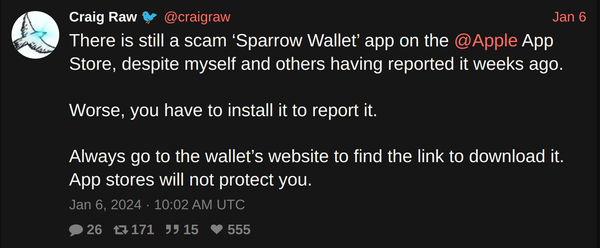
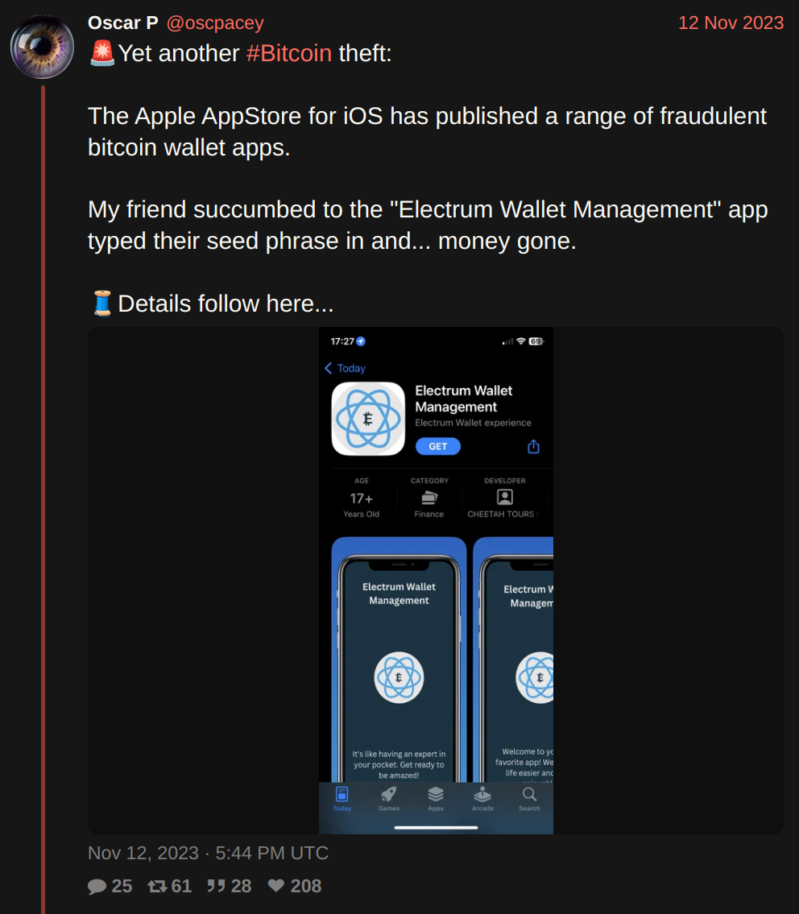
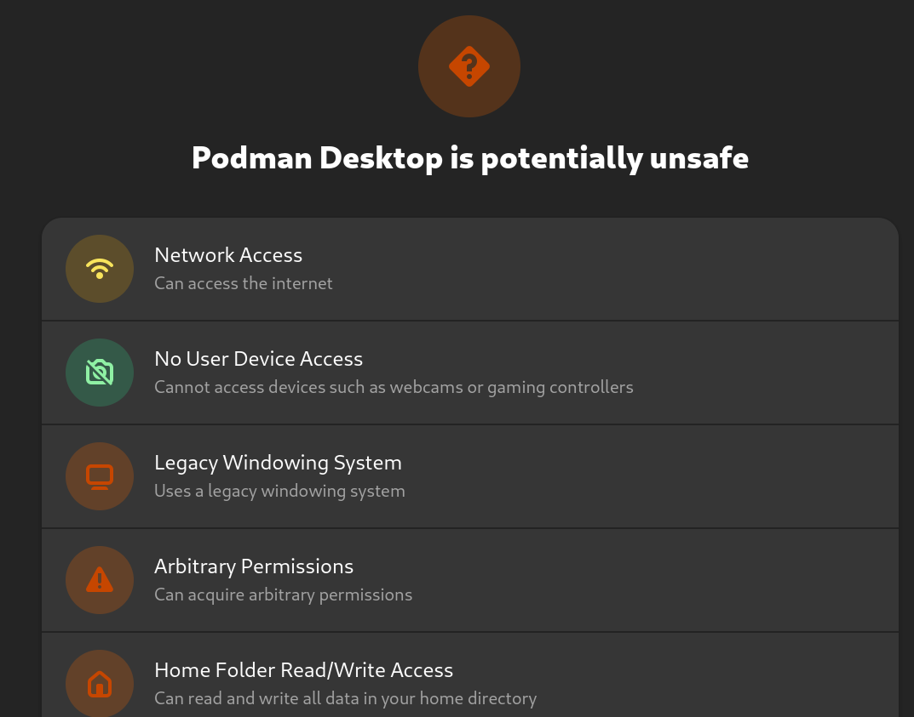

_Originally published at [https://stacker.news/items/404908](https://stacker.news/items/404908)_

There are four angles from which I want to discuss this topic: discoverability, security, reputation and monetization.

The *app store* model, a curated catalog of applications, addresses these in various ways and is by far the most common distribution method. 

Google Play Store and Apple App Store lead the pack with [around 95% market share](https://www.businessofapps.com/data/app-stores/) outside of China. Along with other Android stores (Amazon Store, Samsung Galaxy Store) and the Microsoft Store, they are the major proprietary, closed-source stores. They control every link in the distribution chain.

Open source stores work a bit differently. The store UI can manage apps from multiple repositories. For the most part, though, they are used with the default one: F-Droid (Android) with their official repo, Snap (Ubuntu Linux) with Snapcraft, Flatpak (Linux) with Flathub.

App stores are the only realistic method to distribute applications to humans at scale, but current implementations have important shortfalls. They are all, in varying degrees, trusted third parties offering convenience at the expense of sovereignty in different ways. 

## Discoverability

High-quality search, trending lists, and recommendations are important factors for app discovery.

The main stores are tightly integrated with their respective operating systems so they are the users default go-to. This creates a strong incentive for developers to publish there, and this results in a rich app ecosystem.

But centralization has its problems. The algorithms of these stores may prioritize promoting content, displaying ads or making it difficult to discover niche apps.  They [regularly censor](https://www.coindesk.com/tech/2023/06/28/damus-finally-receives-apple-app-store-approval-after-two-week-battle/) due to state regulations and corporate agendas. (Or just for [some random reason](https://nitter.cz/evankaloudis/status/1727336468920864844#m)). 

The iOS App Store is the most problematic of all. There are no alternative ways of installing apps other than going through tedious hoops. The recent [third-party app store changes in the EU](https://www.theverge.com/2024/1/25/24050200/apple-third-party-app-stores-allowed-iphone-ios-europe-digital-markets-act) is a complete larp: "marketplaces" must still get permission from Apple and only a single version of an app across different stores is allowed.

Open stores do not censor and anyone can add their own repository, but this extra step also hurts discoverability.

One can of course find apps outside the realm of an app store, for instance from links shared in social media. (I'll further discuss the direct download approach in the Security section.)

Furthermore, major stores are split in countries/regions due to legal or regulatory requirements, so apps available in one area may be invisible in another. Enabling localized content may improve discoverability because of the increased cultural relevance.

An app store on nostr, on the other hand, could leverage (borderless) social connections which is way more relevant than a geographic silo. Discovering new apps could become more like getting personalized recommendations from your friends as opposed to browsing a generic list created by minions at a faceless corporation.

Other handy features such as [NIP-51](https://nips.be/51) could bring curated app lists to one-click bulk install (à la [Ninite](https://ninite.com/)), both as personal backup or as recommendations.

## Security

Here I'd like to talk about a few key aspects separately.

 - **Transmission security**: Checking file integrity via digital signatures to prevent tampering
 - **Application security**: Scanning packages for malware and enforcing OS-level runtime security
 - **Privacy**: Preventing private information or metadata leakage

### Transmission security

Apple and Google prevent in-transit attacks through public key infrastructure (PKI). They provide developers with signing certificates, in addition to controlling app store front-ends, domains and file servers.

On Android, signing keys are pinned upon first installation and are enforced on all subsequent updates, along with a mechanism for key rotation. This is the SSH model, also known as [TOFU](https://developer.mozilla.org/en-US/docs/Glossary/TOFU) (Trust On First Use).

While it's possible to add custom repositories, F-Droid builds from source tarballs, hosts and self-signs all but a few packages in their official repo. This has an important downside: you now need to trust them not only on the initial install but on every single update. F-Droid does not build non-free software and has a [host of other issues](https://privsec.dev/posts/android/f-droid-security-issues/).

[IzzyOnDroid](https://apt.izzysoft.de/fdroid/) is probably the most popular F-Droid alternative repository, focused on providing a curated list of APKs excluded from F-Droid official. The main difference between these repos is that Izzy hosts APKs signed by developers.

[Obtainium](https://github.com/ImranR98/Obtainium) is closer to the Izzy approach. It offers no curation but removes one trust layer as packages can be fetched directly from developers' source repositories. Signature verification [is not yet implemented](https://github.com/ImranR98/Obtainium/issues/255) so for now you need to fully trust the host (mostly Github run on Microsoft infrastructure). [AppVerifier](https://github.com/soupslurpr/AppVerifier) is the proposed integration: a step in the good direction but yet another centralized solution relying on certificate hashes rather than developer signatures. 

It is common, especially among open-source developers, to use PGP to ensure artifact integrity, preventing attacks such as phishing, domain hijacking or malicious repositories. 

PGP relies on a [web of trust](https://www.linuxfoundation.org/blog/blog/pgp-web-of-trust-delegated-trust-and-keyservers) to verify the authenticity of signatures. It's a good idea but far from perfect in practice, as it's very challenging to determine trust levels transitively. There is no purely technical solution to the problem of trust, but some choices in the design and implementation of PGP make it even harder.

I'm a developer and regularly get software in this way. I still find it challenging. Obviously obtaining a hash or fingerprint sitting next to the binary makes no sense, so I usually pull keys from one or two (supposedly) reputable keyservers that match some known developer's fingerprint. Fingerprints are not the full PGP key. While it's _probably_ okay, keyservers must be trusted and there have been reports of malicious actors duplicating short key IDs in the wild.

The optimization of security at the expense of user experience leads most users to choose insecure tools over secure ones, so PGP unfortunately did not reach any significant level of adoption.

Keybase was a *very* interesting attempt to improve this situation by mapping users' social identities to PGP encryption keys. Their focus was scattered (messaging, file sharing, etc) and then the team was [aqui-hired by Zoom](https://keybase.io/blog/keybase-joins-zoom) in 2020. Development seems to have virtually stalled ever since.

Could nostr's web of trust be the missing ingredient in the secure transmission of packages?

Nobody uses PGP encrypted email anymore, everybody moved to Signal or SimpleX. And no sane person will undertake the massive effort to build a web of trust from the ground up just to verify a few downloads a year.

But if a _socially active_ network of cryptographic keypairs happens to exist, all of a sudden utility massively increases and the effort of building a network of trusted developers goes down. Since trust is a problem of social nature, there is no better way than deriving it from a naturally social context. Keybase got the idea right, but Nostr is uniquely positioned to solve this problem. Even your mom can now  cryptographically verify a downloaded app.

Let's imagine that [Craig Raw](https://primal.net/p/npub1hea99yd4xt5tjx8jmjvpfz2g5v7nurdqw7ydwst0ww6vw520prnq6fg9v2)'s nsec was compromised. Once aware, he could use [NIP-41](https://thebitcoinmanual.com/articles/what-is-nostr-key-migration/) to perform a key rotation and make the fact public to his nostr social graph. This action would occur relatively fast, circumventing the need for updating key servers and waiting for global synchronization ([which might never happen](https://superuser.com/questions/227991/where-to-upload-pgp-public-key-are-keyservers-still-surviving/228033#228033)). In PGP, a single breach can affect entire branches of the web of trust tree, potentially causing widespread damage with very delayed  detection.

Indexing packages for discoverability vastly improves UX and can be performed by any network participant since these are merely suggestions and packages are always signed and verified.

### Application security

Both the Apple App Store and Google Play Store have their own procedures for reviewing apps before they become available to users. They involve human and automated processes and aim to ensure app quality, security, and compliance with their policies. 

This approach is not foolproof though, some malicious apps can still slip  through the cracks and when it does, it's pretty bad.

Worse yet, they give the illusion of security.

These Big Tech-backed proprietary walled gardens pose additional security risks due to their opaque nature. Corporations are the low-hanging regulatory targets in a world of [ever-increasing](https://www.theguardian.com/world/interactive/2013/nov/01/snowden-nsa-files-surveillance-revelations-decoded) [state surveillance](https://www.newyorker.com/magazine/2022/04/25/how-democracies-spy-on-their-citizens). Never forget, [trusted third parties are security holes](https://nakamotoinstitute.org/trusted-third-parties/).

Open stores appear to be more transparent but still require users to place significant trust in them. F-Droid official repo builds from source tarballs so you need to trust the developer, F-Droid and the transmission of data between them.

Something similar happens with Flathub, which in addition hosts binaries packaged by third parties, yet another layer of trust, as these [community-run projects lack resources](https://reddit.com/r/Fedora/comments/qq5l24/silverblue_without_flathub_flatpaks/). (Guess what fixes this?)

And just like with direct downloads, you also need to trust binaries like an APK to correspond to the source files, unless they use [reproducible builds](https://reproducible-builds.org/) [like Signal does](https://github.com/signalapp/Signal-Android/tree/main/reproducible-builds).

In terms of malware and privacy protection, Android's [PlayProtect](https://developers.google.com/android/play-protect/) checks APKs when installed from non-Google Play sources. Open stores provide scanning via tools like [VirusTotal](https://www.virustotal.com/), [Exodus Privacy](https://exodus-privacy.eu.org/) and [Blacklight](https://themarkup.org/blacklight) but the user can't really pick and choose.

On Nostr, a market of DVMs specialized in app security auditing could arise, as a reputation mechanism for developers, as tools for end users, or both.

Once apps are installed, privacy and security become an operating system level concern. [Sandboxed execution](https://grapheneos.org/features#improved-sandboxing) and varying degrees of permission controls to filesystem, peripherals, network, and so on are used to mitigate further security issues. An app that does not use the Internet should not be granted access to it.

Firewalls like [Little Snitch](https://www.obdev.at/products/littlesnitch/index.html) or [OpenSnitch](https://github.com/evilsocket/opensnitch) for Linux are examples of third-party software that is crucial for maintaining security and privacy.

Craig Raw is a developer that I trust, but after configuring Sparrow to work completely offline (node in my LAN, disabled mempool fee estimation, etc) I was surprised to find an HTTP request to `sparrowwallet.com` with OpenSnitch - which I immediately denied. Is Craig rugging my hot wallet? I went straight to the source code. Turns out it was a simple version upgrade check. So yes, these tools aid us immensely in our strive to verify not trust.

### Privacy

All app stores know the exact set of programs you use. Apple and Google in particular have a double incentive to harvest this data: on the one hand to produce accurate recommendations, and on the other to sell it to data brokers.

Privacy would be significantly improved by making direct downloads easier to verify by anyone, incentivizing the use of privacy-respecting FOSS and switching to trusted DVMs for recommendations and security audits.

## Reputation

Even if an app is perfectly safe, is it worth your time or money?

App stores allow users to review the apps they use. This has its limitations as ratings/reviews can be easily gamed in these centralized systems.

Having a decentralized review system can actually... make it worse. Spam and Sybil attacks are relatively cheap, unless the view of the network can be trusted. And that is exactly where nostr comes in. 

[NIP-32](https://nips.be/32) reviews constrained to a pubkey's web of trust would be the perfect fit.

This type of information is not only useful for other users, it also serves as a feedback mechanism for developers. Many of them derive value exclusively from reputation.

But there is [a better way](https://dergigi.com/value/).

## Monetization

Options for charging money are available on the main stores, but the bullies want their cut. Apple and Google take hefty [15 to 30% commissions](https://www.statista.com/statistics/975776/revenue-split-leading-digital-content-store-worldwide/) on sales and charge developers additional fixed fees. 

Virtually all users and developers need to be KYC'd as they are only allowed to pay by digital fiat means and are forced to use archaic SMS verification. Apart from the privacy concerns, this excludes billions of unbanked users from buying paid apps and unbanked developers from even publishing them in these stores.

Interestingly, it also marginalizes autonomous AI systems that were tasked to publish an app.

A vast majority of the applications published on big stores are free (as in free beer) with a huge percentage of them relying on advertising, [exacerbating the attention problem](https://dergigi.com/2022/12/18/a-vision-for-a-value-enabled-web/).

Open stores offer no monetization options, other than a [donate button](https://f-droid.org/en/packages/org.fossify.gallery/) at best. FOSS developers usually resort to [frictional](https://www.patreon.com/) [and](https://github.com/sponsors) [unreliable](https://opencollective.com/opensource/updates/closing-our-virtual-card-program) donation solutions.

A lot has been written about the [issues with](https://trstringer.com/oss-compensation-broken/) [open source funding](https://stackoverflow.blog/2021/01/07/open-source-has-a-funding-problem/). I can't reach other conclusion than: Bitcoin and Nostr fix this.

Removing the middleman and letting users pay developers directly via zaps, [Nostr Wallet Connect](https://nwc.getalby.com/) or other similar primitives will fundamentally change the way apps are funded and distributed.

It doesn't have to be like this.

## Support

This is an innovative feature given no app store has introduced post-sales support, likely due to misaligned incentives. It's the real, genuine KYC!

Embracing the removal of middlemen between users and developers can open up new possibilities like paid support, bounties, feature request prioritization, and even new business opportunities.

## Moving forward

In the longer term, AI could drive a cambrian explosion of software creation.

Massive improvements to efficiency tend to also cause qualitative changes. The dynamics of app distribution might look totally different than today, we might be [remixing our own apps](https://primal.net/e/note1j9skfcgxgnpk5ekzmxpvwv84x7hzflwgc57v28lwf6k0sd7kpg5qn405ld) like we do with music on [stemstr](https://stemstr.io), and sending back value to [all contributors](https://pkgzap.albylabs.com/).

App discovery mechanisms will require more fine tuning, and review systems to be more trustworthy than they are today.

Scams and malware will multiply, dangerous software will slip through the cracks of centralized stores due to the sheer volume of submissions and the complexity of detecting all potential threats.

Finally, with so much supply and demand from so many different parts of the globe, an open, borderless, neutral medium of exchange is the logical answer to monetization.

Apps are fundamental tools in our quest for self-sovereignity. Draconian regulations and privacy invasive practices will accelerate. Properly establishing trust, sourcing and verifying apps will become more important than ever. 

Most nostr usage at the moment is for social commenting (certainly not as network of package maintainers) but there will be an increasing overlap between the two. 

Can trust scores emerge from webs of trust and other primitives?

Can [NIP-94](https://nips.be/94) replace [manifest files](https://wikiless.org/wiki/Manifest_file?lang=en)?

How do we minimize trust while maximizing UX?

What else would be necessary to disrupt the ~95% big tech market share? 

As an app developer myself, I had only superficially been exposed to these issues. App distribution is a fascinating rabbit hole I recently fell into and I started prototyping the solution I want to see in the world. 

A lot of questions remain. I don't have all the answers, or even the right questions, but I feel there are enough gaps and shortcomings in the current way things are. And significant room for improvement.