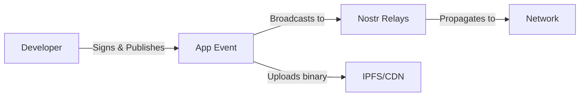

# Architecture Overview

Zapstore is built on a decentralized architecture that ensures no single point of failure or control. This document provides an overview of the key components and how they work together.

## Core Components

### 1. Nostr Protocol Layer

At the heart of Zapstore is the nostr protocol, which provides:

- **Decentralized messaging** - No central servers or control points
- **Cryptographic identity** - Users and developers are identified by public keys
- **Event-based architecture** - All actions are cryptographically signed events
- **Relay network** - Multiple relay servers ensure redundancy and availability

### 2. App Registry

Apps in Zapstore are represented as nostr events with specific tags:

```json
{
  "kind": 30063,
  "tags": [
    ["d", "com.example.myapp"],
    ["name", "My Awesome App"],
    ["version", "1.2.3"],
    ["description", "A productivity tool"],
    ["category", "productivity"],
    ["license", "MIT"],
    ["repository", "https://github.com/example/myapp"],
    ["hash", "sha256:abc123..."],
    ["size", "15728640"],
    ["platform", "universal"]
  ],
  "content": "Extended description and changelog...",
  "created_at": 1234567890,
  "pubkey": "developer_public_key",
  "sig": "signature..."
}
```

### 3. Trust Network

Trust in Zapstore is established through:

- **Cryptographic signatures** - Every app is signed by its developer
- **Web of Trust** - Users can follow and trust specific developers or curators
- **Curator lists** - Community-maintained lists of verified apps
- **Social proof** - See which apps your network uses and recommends

### 4. Content Distribution

Apps are distributed through multiple channels:

1. **IPFS** - Decentralized content-addressed storage
2. **BitTorrent** - Peer-to-peer distribution
3. **HTTP mirrors** - Traditional CDN fallbacks
4. **Nostr blobs** - Small files can be stored directly in events

### 5. Payment Layer

Micropayments are handled via Lightning Network:

```javascript
// Payment flow
1. User initiates install
2. App metadata includes payment requirement
3. Lightning invoice is generated
4. User pays invoice
5. Payment proof is verified
6. App download is authorized
```

## Data Flow

### App Publishing



### App Discovery


### Installation Process


## Security Model

### Cryptographic Verification

Every app goes through multiple verification steps:

1. **Developer signature** - Ensures the app comes from the claimed developer
2. **Content hash** - Verifies the downloaded file matches the published hash
3. **Timestamp validation** - Prevents replay attacks
4. **Version ordering** - Ensures updates are applied in correct order

### Trust Boundaries

```
User Device
├── Zapstore Client (trusted)
│   ├── Signature Verification
│   ├── Hash Validation
│   └── Permission Management
├── Network Layer (untrusted)
│   ├── Nostr Relays
│   ├── Content CDNs
│   └── Payment Network
└── Apps (semi-trusted)
    ├── Signed by Developer
    ├── Sandboxed Execution
    └── Permission-based Access
```

## Scalability Considerations

### Relay Network

- Multiple independent relays ensure availability
- Geographic distribution reduces latency
- Relay operators can specialize (e.g., regional, category-specific)
- Clients can connect to multiple relays simultaneously

### Content Distribution

- IPFS provides automatic deduplication
- Popular apps are cached across the network
- BitTorrent enables peer-to-peer sharing
- Traditional CDNs provide fallback options

### Event Storage

- Relays can implement different retention policies
- Clients cache relevant events locally
- Periodic republishing ensures availability
- Pruning old versions reduces storage needs

## Privacy Features

### User Privacy

- No account registration required
- Pseudonymous identities (public keys)
- Local storage of preferences
- Optional Tor support for network privacy

### Developer Privacy

- Can publish under pseudonym
- No real-world identity required
- Payment privacy via Lightning Network
- Optional reveal of development team

## Interoperability

Zapstore is designed to work with existing systems:

### Package Managers

- Can import from npm, cargo, pip, etc.
- Exports to standard formats
- Compatible with existing build tools

### App Stores

- Can mirror apps from other sources
- Provides APIs for integration
- Supports standard metadata formats

### Development Tools

- CI/CD integration via CLI
- GitHub Actions support
- Automated signing workflows
- Version management tools

## Future Enhancements

### Planned Features

1. **Smart Contracts** - Automated escrow and licensing
2. **Decentralized Reviews** - Cryptographically signed user feedback
3. **Dependency Resolution** - Automatic handling of app dependencies
4. **Cross-platform Sync** - Sync installed apps across devices
5. **Offline Mode** - Full functionality without internet

### Research Areas

- Zero-knowledge proofs for private apps
- Decentralized malware scanning
- Reputation systems
- Governance mechanisms

## Technical Specifications

For detailed protocol specifications, see:

- [Nostr Implementation Possibilities (NIPs)](https://github.com/nostr-protocol/nips)
- [Zapstore Event Kinds](/docs/protocol)
- [API Reference](/docs/api)
- [SDK Documentation](/docs/sdk) 